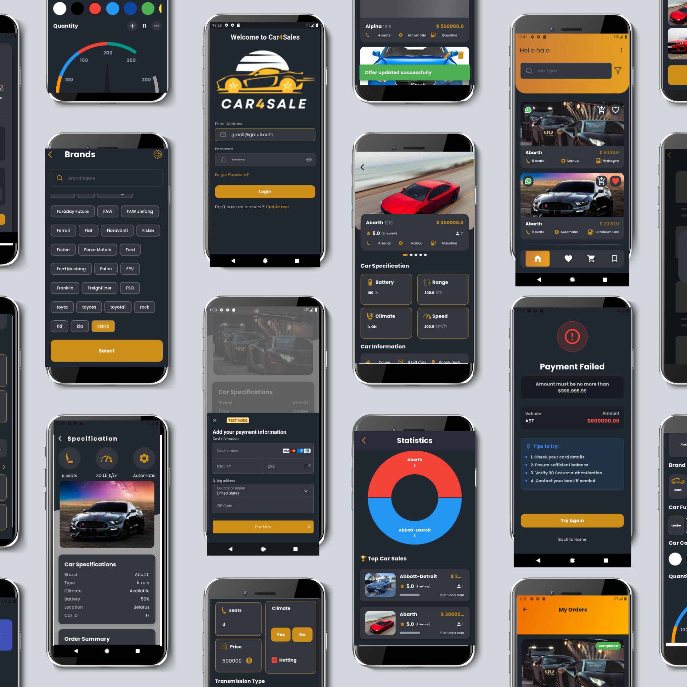

<!-- 🔝 HERO IMAGE -->

  

<h1 align="center">🚗 Car Marketplace App</h1>

A full-featured car marketplace built with Flutter — designed for both buyers and sellers.

  <a href="https://www.linkedin.com/posts/bissan-qwaider-691181233_flutter-dart-stripe-activity-7454882562474143744-zQNF">
    🔗 View Full Project Story on LinkedIn
  </a>

---

## ✨ Overview

This project represents a complete journey—from idea analysis and system design to full implementation.

It reflects my ability to:

* Think like an engineer
* Analyze systems deeply
* Make thoughtful technical decisions
* Build scalable applications using Agile methodology

---

## 🚀 Features

### 👤 Buyer Side

* Browse cars & view details
* Favorites (local storage with SharedPreferences)
* Cart system (add / remove / update)
* Stripe payment integration
* Ratings & reviews
* Order history

### 🛠 Seller Dashboard

* Add / edit / delete cars
* Sales analytics (sold vs unsold)
* Pie chart (top brands)
* Top-selling cars
* Revenue line chart

---

## ⚙️ Tech Stack

| Category     | Technology            |
| ------------ | --------------------- |
| Framework    | Flutter               |
| Architecture | MVC                   |
| State Mgmt   | Provider              |
| Backend      | REST APIs             |
| Database     | SQLite                |
| Charts       | FL Chart              |
| Payments     | Stripe                |
| Auth         | Authentication System |

---

## 🔗 Project Story

I shared the full journey behind this project here:
👉 https://www.linkedin.com/posts/bissan-qwaider-691181233_flutter-dart-stripe-activity-7454882562474143744-zQNF

---

## ❤️ Final Note

This project is more than just code—it's a reflection of persistence, growth, and building despite challenges.
